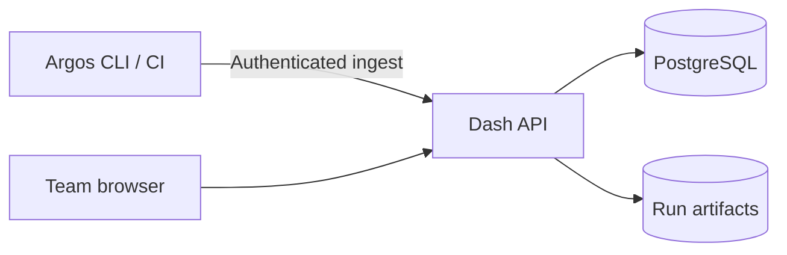

# Argos Dash

**A shared evidence browser for Argos runs.**

[Argos](https://github.com/lpythu/argos) · [Architecture](docs/architecture.md) · [Example pack](https://github.com/benchyard/argos-pack) · [Stack guide](https://github.com/benchyard/stack)

Argos Dash receives run events and artifacts, displays progress and results, and
lets a team discuss the evidence. Tests continue to run in the Argos CLI on your
machine or CI Runner. The dashboard does not execute cases or coding agents.



## Self-host

Requirements: Docker Engine and Compose v2. The build uses public Node, Python and
uv images; no private registry is needed.

```bash
git clone https://github.com/lpythu/argos-dash.git
cd argos-dash
cp .env.example .env
chmod 600 .env
# Set POSTGRES_PASSWORD, DASH_SECRET and DASH_ADMIN_PASSWORD.
# Generate a different value for each with: openssl rand -hex 24
docker compose up --build -d
```

Open http://localhost:8080 and sign in with the configured administrator. The
administrator is created only when the user database is empty. Changing the
bootstrap password later does not reset an existing account.

For a remote installation, terminate HTTPS at your own reverse proxy, set
DASH_PUBLIC_URL and keep the database private. The example binds to loopback.
Back up both named volumes: PostgreSQL metadata and run files. Never use
`docker compose down -v` unless you intend to delete those data.

## Connect a runner

Visit `/cli` after signing in and download a connection file. Store it outside Git:

```bash
argos run web:health --env local --dash /path/to/dash.env
```

Use the public [example pack](https://github.com/benchyard/argos-pack) for a local
fixture. Local username/password login is built in; optional SSO configuration is
described in [architecture](docs/architecture.md). Website sessions and CLI tokens
serve different access paths. Review reports before sharing private application data.

## Develop

```bash
uv sync --frozen
cd ui
pnpm install --frozen-lockfile
pnpm test
pnpm build
pnpm build:report
```

The UI uses Node.js 22.13+ and the pnpm version pinned in `ui/package.json`.
`./dev` starts Vite on port 5173; DEV_API_TARGET defaults to a local backend at
http://127.0.0.1:8080. Override it explicitly for your own development server.

Source is synchronized from the current development implementation, including
SSO, the standalone report viewer and run-detail counts. Deployment-specific
pipelines are examples of one installation, not prerequisites for this Compose setup.

Apache-2.0. See [LICENSE](LICENSE) and [SECURITY.md](SECURITY.md).
