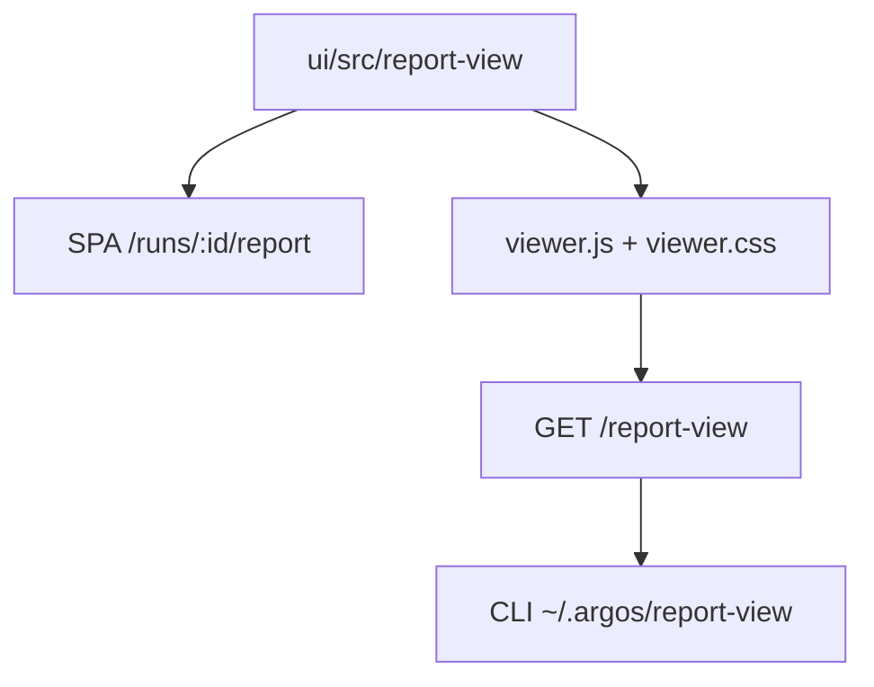
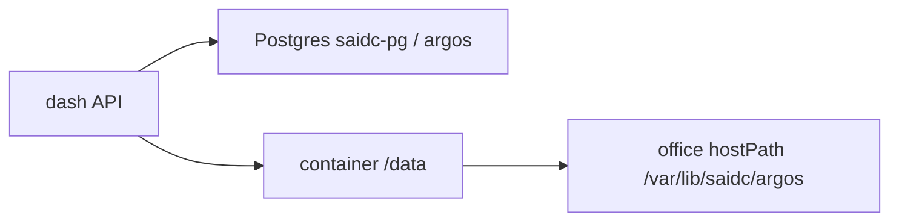
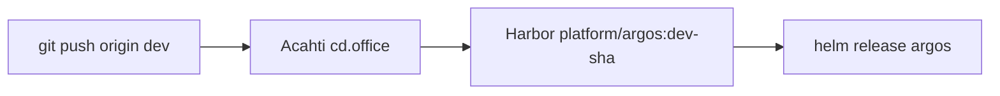

# Architecture

Dash is the hosted run browser for [argos](https://lpythu.github.io/argos/). It does not run cases. Product picture (library vs dash vs packs): https://lpythu.github.io/argos/architecture/

This page is for engineers changing dash UI / report styles.

## Who owns the UI

Source of truth is `ui/src/report-view`. The SPA report page imports it. The same tree builds an IIFE served as public static files. `argospy` downloads those files when a dash URL is configured; it does not vendor React.

Edit styles here. Do not open the GitHub `argos` library for CSS. There is no `@argos/report-view` npm package.

## Data

Run metadata, users, and comments live in Postgres (`DATABASE_URL`). `report.json` and other run files live under `DASH_DATA` (default `/data`), which Helm mounts from the office host path `/var/lib/saidc/argos`. Secrets are env from the chart Secret, not files on that volume.

## Ship

Office only. Push `dev` on this Acahti repo.

Image tag is `dev-{sha}` (and `latest`). No GitHub Actions, no `release.sh` tag.
