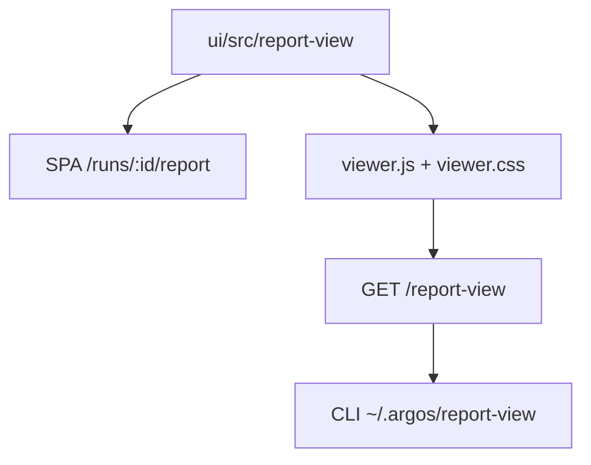
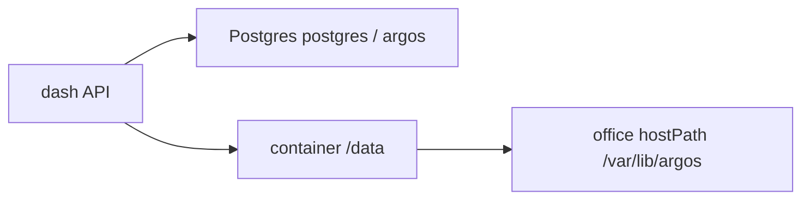
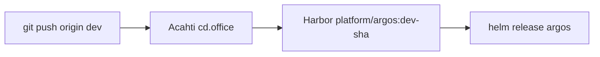
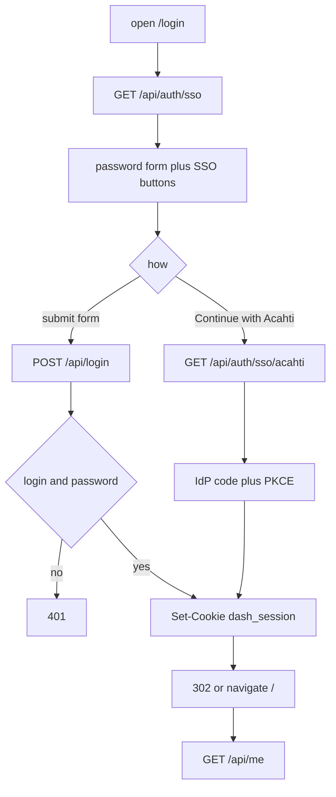
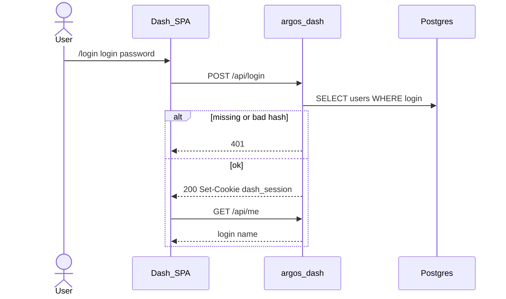
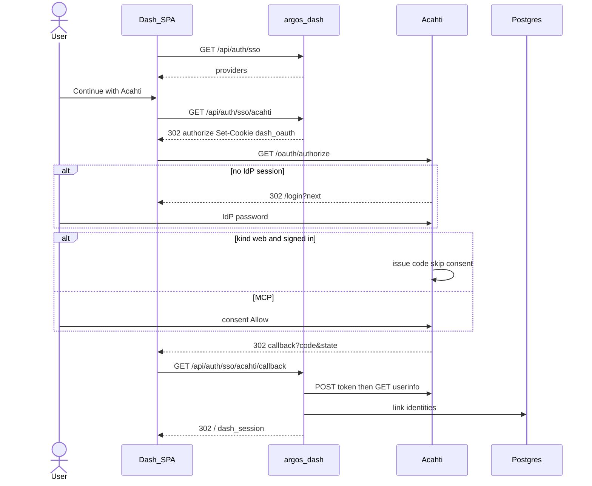

# Architecture

Dash is the hosted run browser for [argos](https://lpythu.github.io/argos/). It does not run cases. Product picture (library vs dash vs packs): https://lpythu.github.io/argos/architecture/

This page is for engineers changing dash UI / report styles.

## Who owns the UI

Source of truth is `ui/src/report-view`. The SPA report page imports it. The same tree builds an IIFE served as public static files. `argospy` downloads those files when a dash URL is configured; it does not vendor React.

Edit styles here. Do not open the GitHub `argos` library for CSS. There is no `@argos/report-view` npm package.

## Data

Run metadata, users, and comments live in Postgres (`DATABASE_URL`). `report.json` and other run files live under `DASH_DATA` (default `/data`), which Helm mounts from the office host path `/var/lib/argos`. Secrets are env from the chart Secret, not files on that volume.

## Ship

Office only. Push `dev` on this Acahti repo.

Image tag is `dev-{sha}` (and `latest`). No GitHub Actions, no `release.sh` tag.

## Auth

Local password login stays. Optional SSO is a list of OAuth 2.0 providers (authorization code + PKCE + userinfo). Acahti is one configured provider in office values, not a hard-coded path. OIDC (discovery / `id_token` / JWKS) can be added later per provider; the RP routes and `identities` table stay.

`GET /api/auth/sso` paints buttons. Both paths end in the same `dash_session` cookie (signed user UUID, 14 days). The IdP access token is used once in the callback and is not stored.

### Password

1. `POST /api/login` `{login, password}`.
2. Lookup `users`, `check_password`. Failure is 401 for both missing user and bad password.
3. `dash_session` = signed `user.id`, HttpOnly, `samesite=lax`, `secure` when `DASH_PUBLIC_URL` is https.
4. SPA `GET /api/me`. Missing or bad cookie returns to `/login`.

### SSO

`{id}` comes from `DASH_SSO_PROVIDERS`. Office uses `acahti` as the first id.

1. `GET /api/auth/sso` returns `{id, name}` only.
2. Browser goes to `GET /api/auth/sso/{id}` (full navigation).
3. Dash writes `dash_oauth` (state + PKCE verifier) and 302s to `authorize_url`.
4. IdP authenticates the person (Acahti cookie `acahti`, not dash password).
5. First-party `kind=web` skips consent; others show the consent page. Code is one-time and bound to `redirect_uri` + PKCE.
6. Callback checks `state`, exchanges `code` + `code_verifier` on the server, then `GET userinfo_url`.
7. Link: existing `identities(provider, subject)` → that user; else matching `users.login` → attach identity; else JIT user with null `password_hash`.
8. Same `dash_session` as password login. Failures redirect to `/login?error=sso`.

| Ticket | Issuer | Where | Lifetime | Role |
|---|---|---|---|---|
| `dash_oauth` | dash | browser | minutes | PKCE verifier + state |
| IdP `code` | IdP | redirect query | ~5 min, once | exchange token |
| IdP access token | IdP | dash process | callback only | userinfo |
| IdP cookie | IdP | IdP host | IdP policy | skip IdP login next time |
| `dash_session` | dash | dash host | 14d | dash APIs |

### Contract

Env `DASH_SSO_PROVIDERS` is a JSON list. Each item: `id`, `name`, `client_id`, optional `client_secret`, `authorize_url`, `token_url`, `userinfo_url`, `login_claim`, `name_claim`.

| Path | Role |
|---|---|
| `GET /api/auth/sso` | enabled providers |
| `GET /api/auth/sso/{id}` | start PKCE |
| `GET /api/auth/sso/{id}/callback` | token, userinfo, session |
| `POST /api/login` | local password |
| `POST /api/logout` / `GET /api/me` | session |

CLI ingest (`DASH_INGEST_TOKEN`) is unrelated. Adding Google later is another values row (same three URLs).
